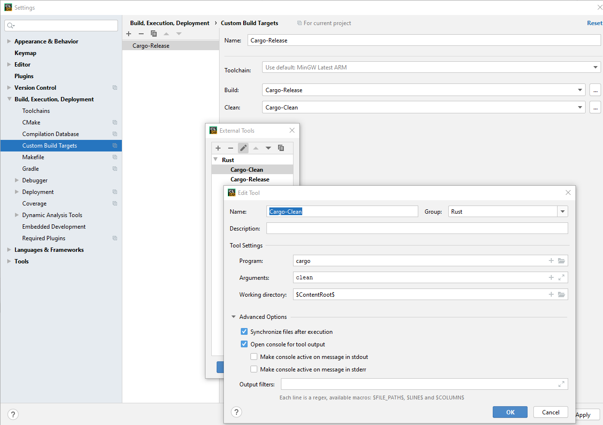
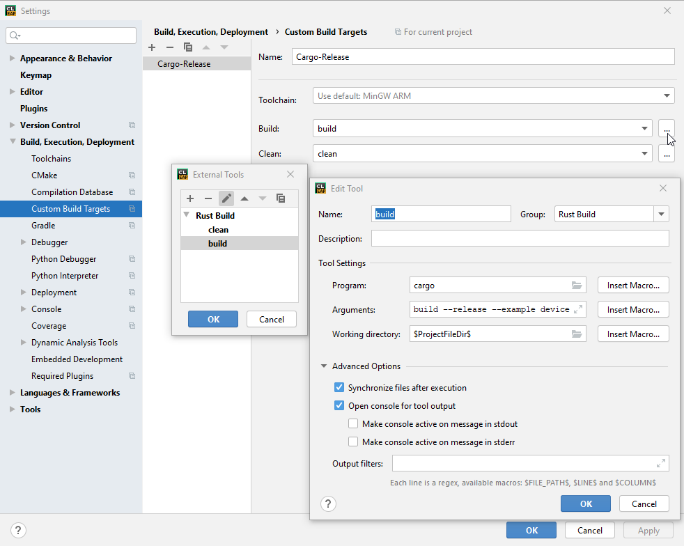
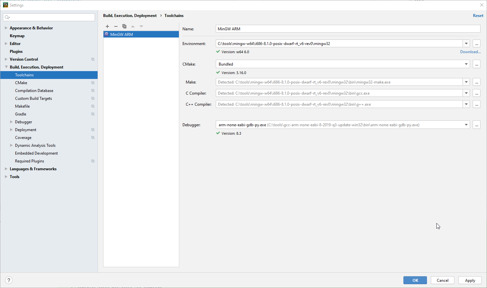
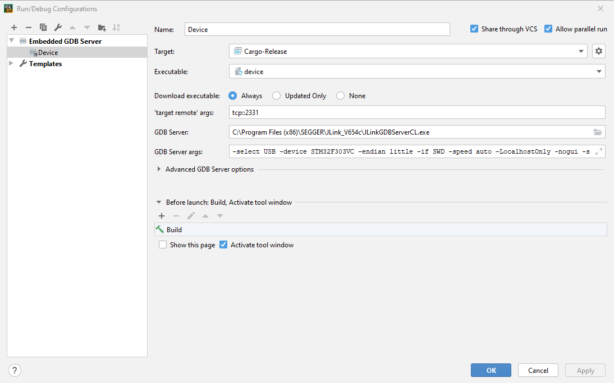
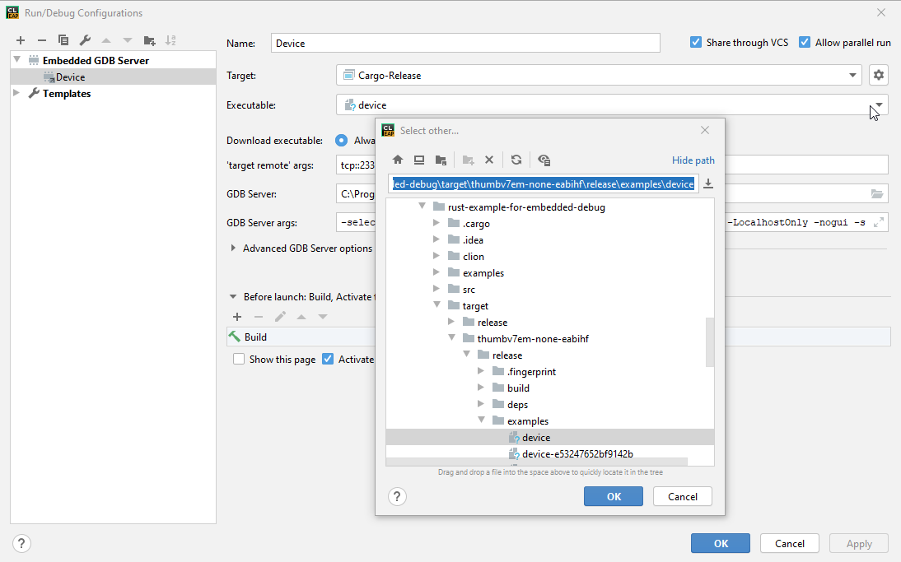

Configuring CLion
===

 * Install Rust Plugin
 * Open the project
 * Configure `Custom Build Tools` via `Settings->Build, Execution & Deployment`
   * Use `Cargo-Release` name
   * Clean tool
 
   * Build Tool
 
 * Configure cross-toolchain via `Settings->Build, Execution & Deployment -> Toolchains`
  
 * Configure `Run Configuration`
   * Setup Target `Cargo-Release`
   * Setup GDB server
  
   * Select target binary
  
  * Set reasonable breakpoint
  * Start Debugger
  